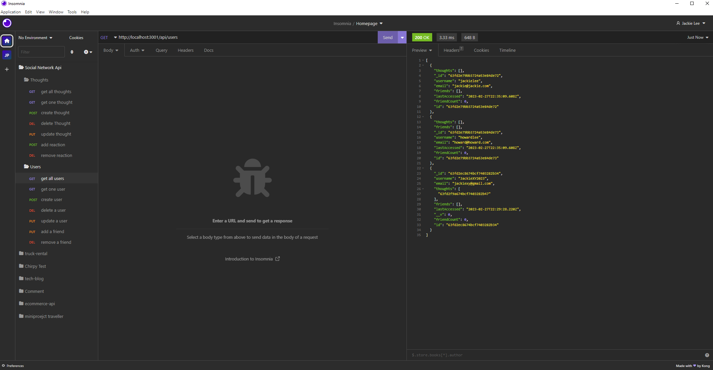

# social-network-api
an social network api application that uses mongodb 

## Description

This is a social network api that uses a mongodb database with mongoose. There are routes you can use to add data into our tables. You can create a user, get information about one or all users. Delete a user as well as update a user. The social network api also have the ability to add friend to a user data. 
Users are also linked to Thoughts. This api will allow you to create, delete, update and find a thought. Each thought also contain a reaction. 

What I learned from this project is the usage of Mongoose with MongoDB. I learned how to create schema structures for models as well as virtuals to get different data. I also learned a new way to use controller by exporting the methods into routes for easier legibility. 

## Installation

After cloning all the files from the respository you would need to install a few packages to be able to run this application. First you will need to install mongoDB into your computer. Then You would need node.js, mongoose and epress. With the included package.json file in the repository you would only need to run "npm install" after installing node.js into your local machine. 

## Usage
- install mongoDB
- install node.js
- install express 
- npm run seed
- run node server.js in the root folder to start the server
- go to localhost:3001 or if you deployed it to a server go to the live page
- go on insomina to test the routes

[link to video walkthrough](https://drive.google.com/file/d/1-QrNA6wGtPzKM2YZWM4_08a3N1ljrefD/view)

## Credits

N/A

## License

N/A

---

## Features

Social network API that lets you manipulate different user data as well as different thought data. Thoughts and Users are connected via ObjectIds